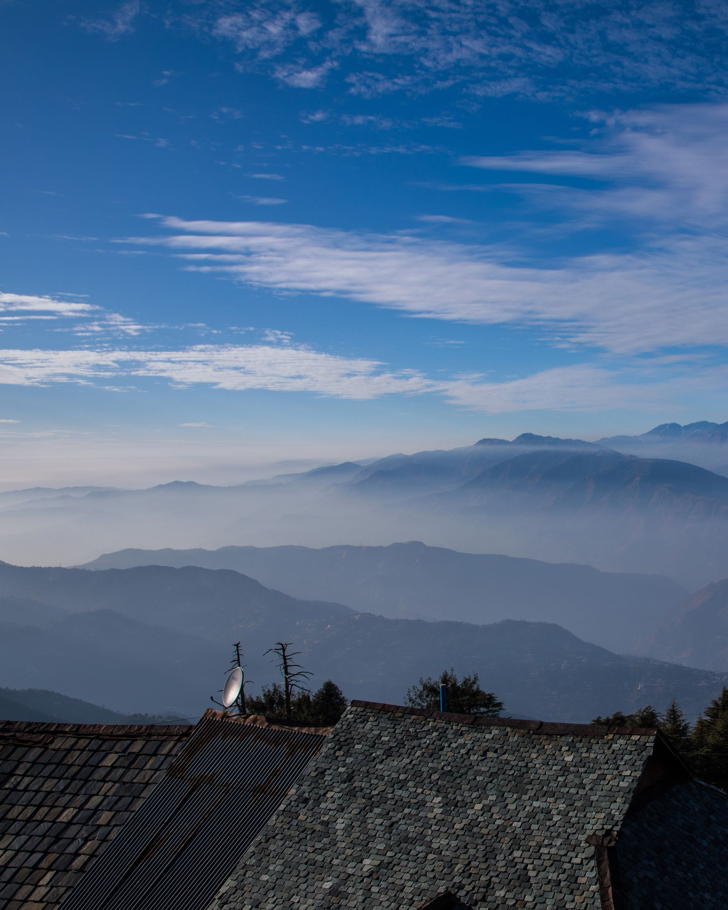

# Explore India Website

Welcome to the Explore India website project! This project showcases various trekking and adventure events across India. The website is built using HTML, Tailwind CSS, and JavaScript.

## Live Preview
- [Link](https://explore-india-bgbhimani13.vercel.app/)

## Table of Contents
- [Features](#features)
- [Technologies Used](#technologies-used)
- [Setup Instructions](#setup-instructions)
- [Project Structure](#project-structure)
- [Screenshots](#screenshots)
- [Contributing](#contributing)
- [License](#license)

## Features
- **Responsive Design**: The website is fully responsive and works on all devices.
- **Dynamic Content**: Navigation bar and footer are dynamically loaded from an external HTML file.
- **Carousel**: Image carousel showcasing various events.
- **Booking System**: Simple booking system with increment and decrement functionality.
- **Local Storage**: Stores booking details in local storage.
- **Payment Redirection**: Redirects to a payment page with calculated total amount.

## Technologies Used
- **HTML**
- **CSS**
- **JavaScript**
- **Bootstrap** (for additional styling and components)

## Setup Instructions
1. **Clone the repository**:
    ```bash
    git clone https://github.com/your-username/explore-india.git
    ```
2. **Navigate to the project directory**:
    ```bash
    cd explore-india
    ```
3. **Open the project in your preferred code editor**.
4. **Open `index.html` in your browser to view the website**.

## Project Structure
```
/E:/Sem 3 Project/Explore India
│
├── /src
│   ├── /home
│   │   ├── Adevanture.jpg
│   │   ├── beach.jpg
│   │   ├── nature.jpg
│   │   ├── pease.jpg
│   │   └── thrill.jpg
│   ├── /Kedarkantha
│   │   ├── img0.jpg
│   │   ├── img1.jpg
│   │   ├── img2.jpg
│   │   ├── img3.jpg
│   │   ├── img4.jpg
│   │   └── img5.jpg
│   ├── /highlite
│   │   ├── kedarkantha.png
│   │   ├── brahmatal.jpg
│   │   ├── Dalhousie.png
│   │   ├── jaisalmer.png
│   │   ├── kashmir.png
│   │   └── manali.jpg
│   ├── /Snow trek
│   │   ├── brahmatal.jpg
│   │   ├── dalhousie.jpg
│   │   ├── kashmir.jpg
│   │   ├── kasol manali.jpg
│   │   ├── kedarkantha.jpg
│   │   ├── manali winter.jpg
│   │   └── spiti winter.jpg
│   ├── /Family Adventures
│   │   ├── dalhousie.jpg
│   │   ├── jaisalmer.jpg
│   │   ├── kasol manali.jpg
│   │   └── kedarkantha.jpg
│   ├── /weekend events
│   │   ├── jaisalmer.jpg
│   │   ├── kutch.jpg
│   │   ├── maharashtra.jpg
│   │   ├── polo forest.jpg
│   │   └── saputara.jpg
│   └── /pdfs
│       └── kedarkantha.pdf
│
├── index.html
├── kedarkantha.html
├── navbar-footer.html
├── style.css
└── script.js
```

## Screenshots
### Home Page


### Kedarkantha Trek Page


## Contributing
Contributions are welcome! Please fork the repository and create a pull request with your changes.

## License
This project is licensed under the MIT License.